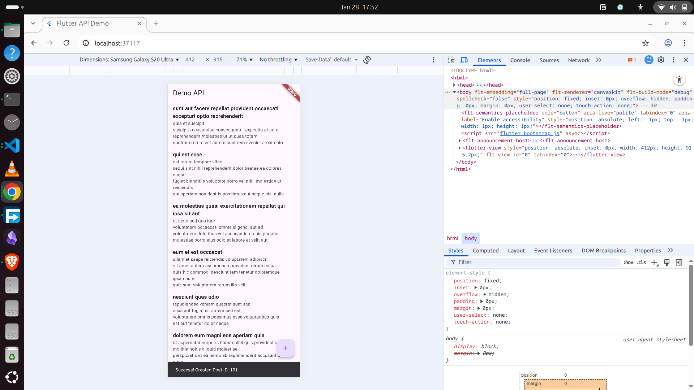

# remote_app

A Flutter project demonstrating **API integration** using HTTP requests.

This app fetches data from a remote API and displays it in a list, and also demonstrates sending data (POST request) to the API.

---

## 📸 App Screenshot

